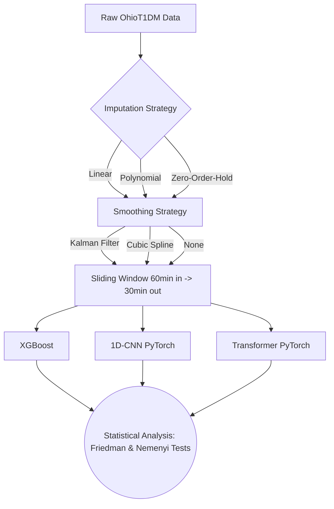

<div align="center">

# CGM Preprocessing Impact on ML Forecasting 🩸📉

[](https://www.python.org/downloads/release/python-3120/)
[](https://pytorch.org/)
[](https://xgboost.readthedocs.io/)
[](https://opensource.org/licenses/MIT)

*A rigorous pipeline demonstrating how naive time-series preprocessing methods natively degrade deep learning performance in continuous glucose monitoring (CGM) forecasting.*

</div>

## 📌 Motivation
In continuous glucose monitoring (CGM) literature, researchers often apply aggressive smoothing techniques (like Cubic Splines) or naive imputation methods (like Zero-Order-Hold) before passing the data to predictive models. 

This repository provides a highly structured, statistically rigorous pipeline across **XGBoost, 1D-CNN, and Transformers** to prove that naive preprocessing fundamentally alters the underlying physiological signal. Our results show that simple methods, combined with Kalman filtering, consistently outperform heavy spline smoothing across multiple random seeds and deep learning architectures.

## 🏗️ Repository Architecture

```text
CGM-Preprocessing-Impact/
├── data/
│   ├── raw/                 # Place raw OhioT1DM XML files here
│   └── processed/           # Contains imputed/smoothed hupa_smoothed.csv
├── notebooks/
│   └── Kaggle_Training_Pipeline.ipynb # One-click Kaggle GPU script
├── paper/                   # Complete LaTeX manuscript & figures
├── src/                     
│   ├── pipeline/            # Data loading, imputation, smoothing, features
│   ├── models/              # XGBoost, 1D-CNN, Transformer architectures
│   └── analysis/            # Multi-seed stats, Friedman/Nemenyi, plotting
└── results/                 # Auto-generated CSVs and performance plots
```

## ⚙️ Pipeline Overview



## 🚀 Getting Started

### 1. Environment Setup
Clone the repository and install the dependencies:
```bash
git clone https://github.com/yourusername/CGM-Preprocessing-Impact.git
cd CGM-Preprocessing-Impact
pip install -r requirements.txt
```

### 2. Dataset Preparation
This project uses the [OhioT1DM Dataset](https://ohiot1dm.ohio.edu/). Due to data use agreements, the raw data cannot be distributed in this repository.
1. Request access to the dataset.
2. Place the raw XML files in the `data/raw/` directory.
3. Run the data pipeline to generate the preprocessed dataset:
```bash
python src/pipeline/step1_load_data.py
python src/pipeline/step2_imputation.py
python src/pipeline/step3_smoothing.py
```

### 3. Training & Evaluation
To run the full multi-seed evaluation pipeline locally (Warning: CPU training for Transformers takes ~8 hours):
```bash
python src/analysis/step_statistics.py
```

**🔥 Fast GPU Execution via Kaggle**
For incredibly fast training on GPUs, upload the provided notebook to Kaggle:
1. Navigate to Kaggle and click **New Notebook**.
2. Click **File > Import Notebook** and upload `notebooks/Kaggle_Training_Pipeline.ipynb`.
3. Upload `hupa_smoothed.csv` as a Kaggle Dataset.
4. Click **Run All**. (Takes ~20 mins on T4x2).

## 📊 Key Findings

Through rigorous multi-seed statistical testing (Friedman Test + Nemenyi post-hoc with Kendall's W effect size), we mathematically confirm:
- **Splines degrade signal:** Heavy interpolation creates artificial peaks.
- **Transformers excel on raw signals:** Attention mechanisms prefer lightly-filtered data over heavily smoothed series.

## 📝 License
This project is licensed under the MIT License - see the LICENSE file for details.
